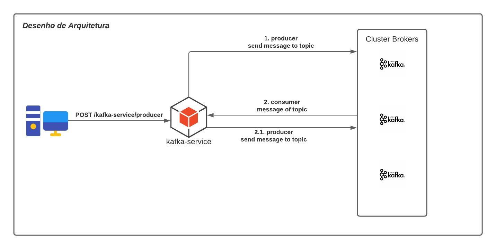

# spring-kafka-producer-consumer-service

Microserviço desenvolvidor para enviar e receber eventos do kafka.

## Introdução

Este projeto está estruturado nos seguintes fluxos:

- Recebimento de um http request POST localhost:8080/kafka-service/producer.

    Exemplo de um cURL: `curl -L -X POST 'localhost:8080/kafka-service/producer'`
    
    Então, será enviado um stream message para o topic `ECOMMERCE_NEW_TOPIC`

- Com o consumer habilitado, ele consumirá do topic `ECOMMERCE_NEW_TOPIC` e gerará um stream com o mesmo payload para outro topic `ECOMMERCE_HISTORY`      

## Requisitos

- Java 11
- Maven
- Docker

## Como usar

1. Gerar o artefato execute o comando: `mvn clean package`;
2. Gerar a imagem docker `docker build -t kafka-service .`;
3. Subir os containers `docker-compose up -d`
4. Execute seus testes com `curl -L -X POST 'localhost:8080/kafka-service/producer'`

## Estrutura do projeto

### kafka-service:

#### Libs utilizadas

- spring-boot-starter-web
- spring-kafka
- lombok

#### Principais configurações:

- kafka.bootstrap-servers: local do server
- kafka.producer.acks: confirmação de recebimento dos brokers

- kafka.consumer.properties.spring.json.trusted.packages: base package para fazer o parse no consumer
- kafka.consumer.group-id: nome do grupo do consumer
- kafka.consumer.auto-offset-reset: ao iniciar a aplicação deverá consumir tudo ou iniciar da última posição
- kafka.consumer.max-poll-records: numero de record por thread a ser consumida
- kafka.consumer.enable-auto-commit: flag para habilitar o auto commit quando ms > 'x' ms
- kafka.consumer.listener.concurrency: numero de threads em concorrencia no consumer

- application.kafka.listener.enable: flag para habilidar ou desabilidar o consumidor
- application.kafka.topics.notification: nome do primeiro topic que será enviado e a ser consumido
- application.kafka.topics.history: nome do segundo topic que será enviado

### docker-compose:

- 3 brokers de kafka
- 1 zookeeper: 
- 1 kafdrop: painel para visualizar os brokers do kafka
- 1 kafka-service

## Desenho de arquitetura do fluxo

